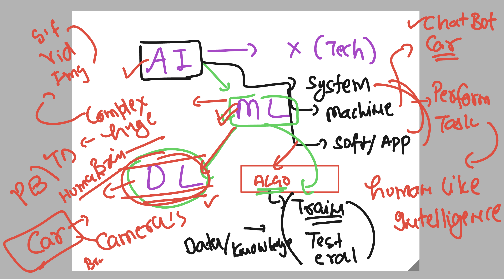
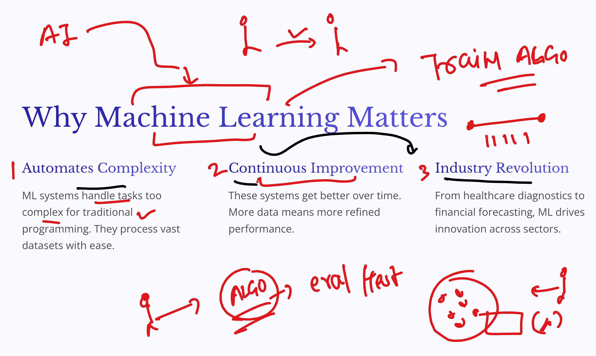
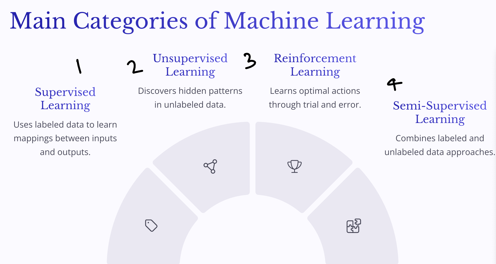
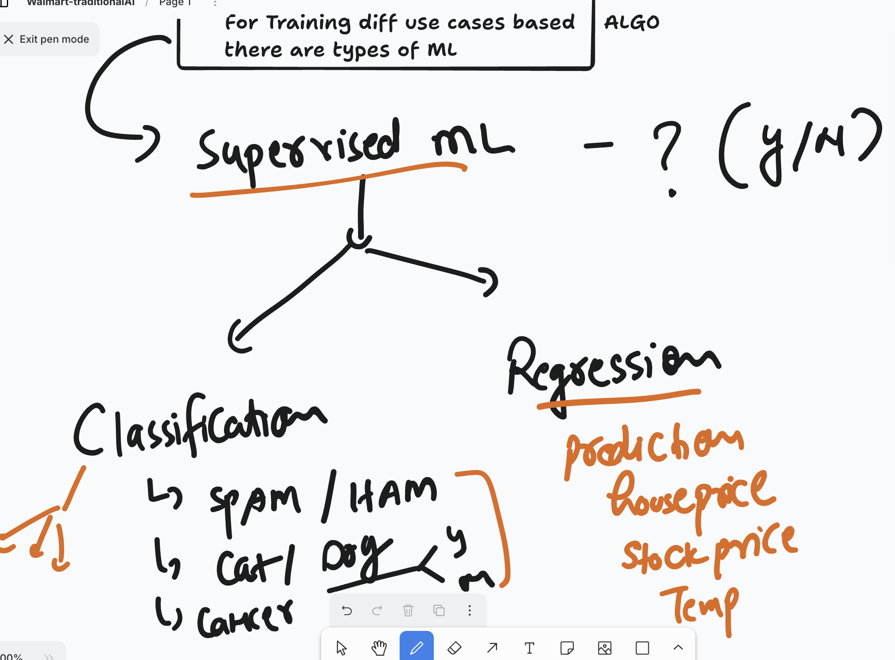
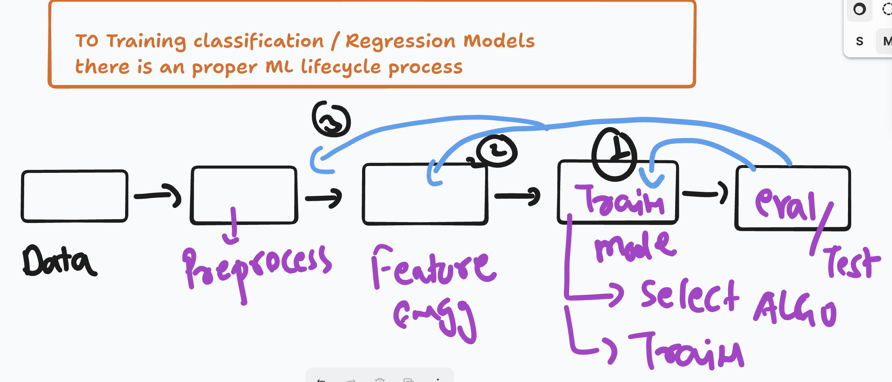

# walmart_traditionalAI_16thjune2025

### starting with Machine learning understanding 



### WHY ML matters



### type / category of ML 



### type of supervised ML 



### Installing any module in python 

```
!pip install numpy
```

### To traing any ML model we have a proper lifecyle 

