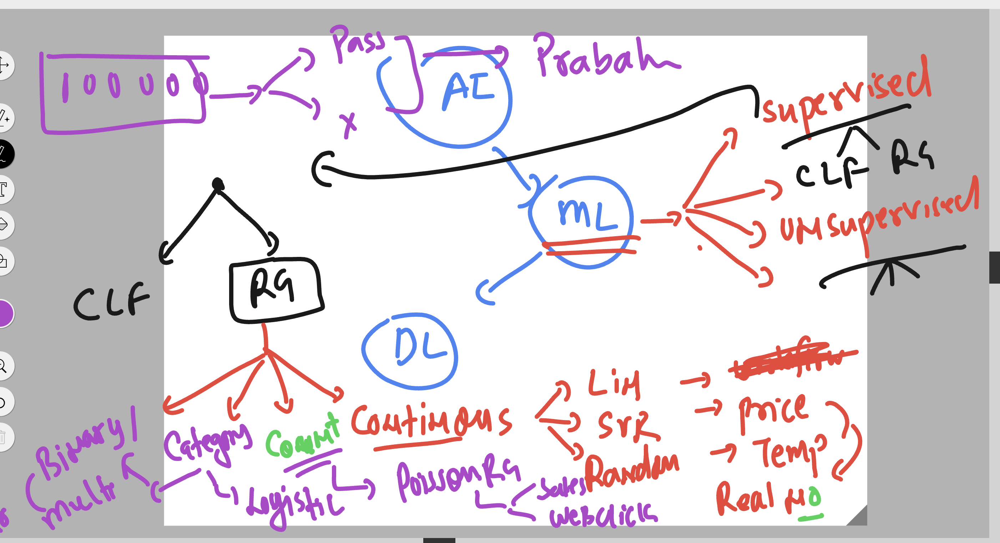
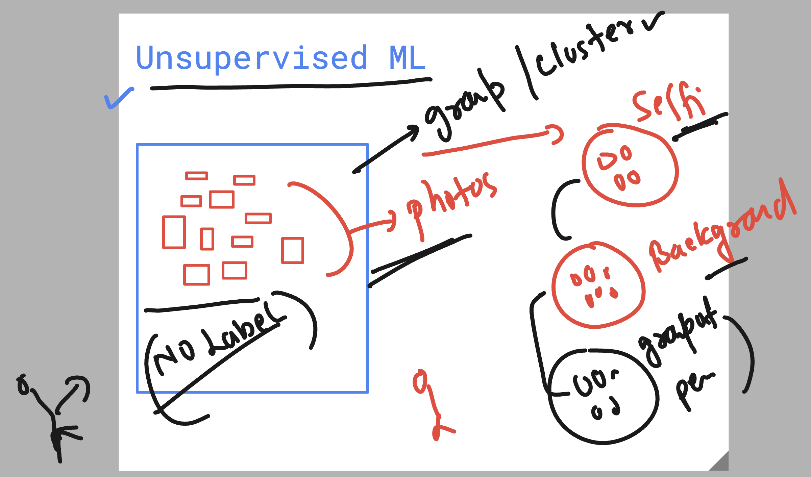

### few info about Regression and classification 

## starting with Unsupervised ML 

### Example 1 

## 🛒 Walmart Context Example

Let's apply unsupervised learning to a Walmart India use case.

**Scenario:**  
Walmart operates hundreds of stores across India, each with unique characteristics:

- **Store size** (in sq. ft)
- **Footfall** (number of daily customers)
- **Region** (urban, rural)
- **Average income** of local customers
- **Sales volume**

However, Walmart hasn't labeled stores as "premium", "budget", or "low-footfall".

**Problem:**  
Walmart wants to group similar stores together to:

- Run targeted marketing campaigns
- Optimize stock levels per store type
- Make decisions on store expansions or renovations

**How Unsupervised Learning Helps:**  
By using clustering algorithms like K-Means, we can automatically group stores into clusters:

- **Cluster 0:** Small-town stores with low income and low footfall
- **Cluster 1:** Metro stores with high income and high footfall
- **Cluster 2:** Mid-sized city stores with average metrics
